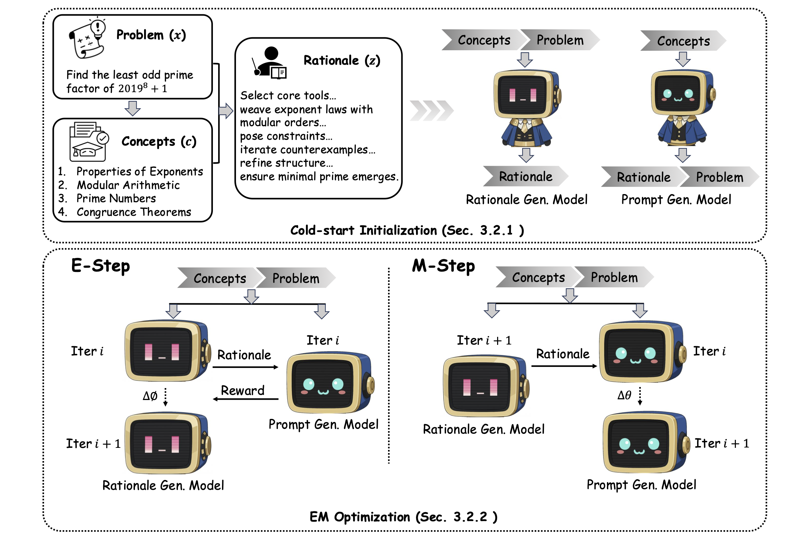

<h1 align="center">PromptCoT 2.0</h1>

<p align="center">
  <b>Scaling Prompt Synthesis for LLM Reasoning</b>
</p>

<p align="center">
  <a href="https://arxiv.org/abs/2509.19894">📄 Paper</a> •
  <a href="https://huggingface.co/collections/xl-zhao/promptcot-20-68d27cd73f2faef5a12f777d">🤗 Hugging Face</a>
</p>

<p align="center">
  
</p>

---

## ✨ Overview

PromptCoT 2.0 is a principled and scalable framework for **prompt synthesis** that substantially advances LLM reasoning in both **mathematics** and **programming**.  

It introduces an **EM-style rationale-driven synthesis loop** (*concept → rationale → problem*), enabling the automatic generation of diverse and challenging problems at scale. These synthetic prompts support two complementary training regimes:  

**Self-Play**: the model improves autonomously by learning from verifiable signals (e.g., unit tests for code, boxed answers for math). With this approach, a **30B-A3B self-play model** achieves **92.1 on AIME24, 89.8 on AIME25, and 76.7 on HMMT Feb25**, as well as **74.2 on LiveCodeBench v5, 71.0 on v6, and 2079 Elo on Codeforces**. These results surpass strong open-source baselines (Qwen3-30B-A3B-Thinking) and achieve **competitive performance** with closed-source leaders such as Gemini 2.5 Pro and OpenAI o3 across math and code.

**SFT**: a **7B** model trained **100% on synthetic data**—using prompts synthesized by PromptCoT 2.0 and **complete reasoning trajectories distilled from GPT-OSS-120B (medium)**—reaches **73.1 on AIME24, 65.6 on AIME25, and 1815 Elo on Codeforces**, outperforming counterparts trained on **human-written prompts**.


Unleash the PromptCoT tide of reasoning!

---

## ⚡ Main Results

**Self-Play @ Qwen3-30B-A3B-2507-Thinking:**  

<p align="center">
  
</p>
<p align="center">
  <em>
  PromptCoT 2.0 demonstrates that large-scale <b>self-play with verifiable signals</b> is effective for advancing LLM reasoning.  
  At 30B scale, self-play achieves performance competitive with closed-source leaders (Gemini 2.5 Pro, OpenAI o3) and surpasses strong open-source baselines.
  </em>
</p>

**SFT @ Qwen2.5-7B-Instruct:**  

<p align="center">
  
</p>
<p align="center">
  <em>
  PromptCoT 2.0 (7B, SFT) is the <b>first model trained entirely on synthetic prompts</b> with trajectories distilled from GPT-OSS-120B.  
  Unlike OpenCodeReasoning and OpenMathReasoning — both built on <b>human-written prompts</b> — PromptCoT 2.0 achieves stronger performance, highlighting the potential of <b>fully synthetic prompt synthesis</b> as a foundation for reasoning models.
  </em>
</p>

---

## 🔮 Releases

[2025/09/24] We release [PromptCoT 2.0](https://arxiv.org/abs/2509.19894):  
the first framework to scale prompt synthesis across both math and programming, enabling 30B self-play competitive with Gemini 2.5 Pro / OpenAI o3, and 7B SFT (100% synthetic prompts) surpassing human-written baselines.  

**📂 Resources**  
- **SFT Data (4.8M fully synthetic prompts + trajectories)**: [PromptCoT-2.0-SFT-4.8M](https://huggingface.co/datasets/xl-zhao/PromptCoT-2.0-SFT-4.8M).
- **SFT Model (7B)**: [PromptCoT-2.0-SFT-7B](https://huggingface.co/xl-zhao/PromptCoT-2.0-SFT-7B).
- **Self-Play Data**: [PromptCoT-2.0-SelfPlay-30B-11K](https://huggingface.co/datasets/xl-zhao/PromptCoT-2.0-SelfPlay-30B-11K) and [PromptCoT-2.0-SelfPlay-4B-48K](https://huggingface.co/datasets/xl-zhao/PromptCoT-2.0-SelfPlay-4B-48K).
- **Self-Play Models**: [PromptCoT-2.0-SelfPlay-30B-A3B](https://huggingface.co/xl-zhao/PromptCoT-2.0-SelfPlay-30B-A3B) and [PromptCoT-2.0-SelfPlay-4B](https://huggingface.co/xl-zhao/PromptCoT-2.0-SelfPlay-4B).  
- **Problem Generation Model**: [PromptCoT-2.0-Prompt-Generation-Model](https://huggingface.co/xl-zhao/PromptCoT-2.0-Prompt-Generation-Model).  


[2025/05/30] We release [PromptCoT-Mamba](https://arxiv.org/abs/2505.22425) ([🤗 PromptCoT-Mamba-7B](https://huggingface.co/xl-zhao/PromptCoT-Mamba-7B)):  
the first attention-free reasoning model, combining PromptCoT with Mamba-2 to achieve strong math & code performance with constant-memory inference.  


[2025/04/11] We release [PromptCoT-QwQ-32B](https://huggingface.co/xl-zhao/PromptCoT-QwQ-32B) and [PromptCoT-QwQ-Dataset](https://huggingface.co/datasets/xl-zhao/PromptCoT-QwQ-Dataset):  
self-play of QwQ-32B using PromptCoT synthetic problems, with dedicated datasets for reproducible training.  


[2025/03/07] We release [PromptCoT 1.0](http://arxiv.org/abs/2503.02324) (🤗 [HF Collection](https://huggingface.co/collections/xl-zhao/promptcot-10-68d27ce16efc9cbad4b5c878)):  
the first rationale-driven synthesis pipeline for Olympiad-level math problems, releasing problem generation models, distilled models, and datasets.  


---

## Quick Start

```bash
git clone https://github.com/inclusionAI/PromptCoT
cd PromptCoT
pip install -r requirements.txt
````

---

## Self-Play Pipeline (Code Example)

We illustrate the self-play workflow in the **code domain**, where unit tests provide verifiable reward signals.

---

**Step 1 — Verifiable Reward Generation (test case construction)**  
The input `.jsonl` file must include a `"problem"` field for each instance, specifying the coding task to be solved.  
In each run, a new test case is generated and appended to the `"completions"` field, progressively enriching the specification.  

````bash
# Generate 4 rounds of test cases with different seeds
for seed in {0..3}; do
  python test_cases_generation.py \
    --seed $seed \
    --data_path code/prompts_test_cases_${seed}.jsonl \
    --output_path code/prompts_test_cases_$((seed+1)).jsonl \
    --model_path Qwen/Qwen3-32B \
    --n_gpus 4 \
    --temperature 0.6 \
    --max_len 16384 \
    --use_chat_template True
done
````

Post-process the generated test cases into a structured format:

````bash
python test_cases_postprocess.py \
  --input_file code/prompts_test_cases_4.jsonl \
  --output_path code/prompts_test_cases_processed.jsonl
````

---

**Step 2 — Self-Play Trajectory Collection**
Using the processed test cases, generate diverse trajectories by sampling across multiple seeds:

````bash
for seed in {0..7}; do
  python infer_self_play.py \
    --data_path code/selfplay_${seed}.jsonl \
    --output_path code/selfplay_$((seed+1)).jsonl \
    --model_path Qwen/Qwen3-30B-A3B-Thinking-2507 \
    --trust_remote_code True \
    --n_gpus 8 \
    --num_splits 4 \
    --num_completions 8 \
    --seed $seed \
    --temperature 1.2 \
    --max_len 81920 \
    --use_chat_template True
done
````

---

**Step 3 — Reward Assignment**
Evaluate each trajectory against the constructed test cases and assign reward signals automatically:

````bash
python self_play_eval.py \
  --data_path code/selfplay_8.jsonl \
  --output_path code/selfplay_verified.jsonl \
  --eval_type code \
  --num_workers 16
````

---

**Step 4 — Pair Construction**
Aggregate verified trajectories into **chosen vs. rejected** pairs for offline self-play training:

````bash
python prepare_self_play_data.py \
  --data_path code/selfplay_verified.jsonl \
  --output_path code/selfplay_training.jsonl
````

---

## SFT Pipeline (Code Example)

We illustrate the SFT workflow in the **code domain**, using teacher trajectories from GPT-OSS-120B.

---

**Step 1 — Teacher Trajectory Collection**
Sample teacher responses for each prompt, with one trajectory per problem:

````bash
python infer_self_play.py \
  --data_path code/prompts_test_cases_processed.jsonl \
  --output_path code/prompts_trajectories.jsonl \
  --model_path openai/gpt-oss-120b \
  --trust_remote_code True \
  --n_gpus 8 \
  --num_splits 4 \
  --num_completions 1 \
  --seed 0 \
  --temperature 1.0 \
  --max_len 16384 \
  --use_chat_template True
````

---

**Step 2 — Data Post-Processing**
Filter incomplete or invalid trajectories, and format them into clean prompt–completion pairs for supervised fine-tuning:

````bash
python prepare_sft_data_code.py \
  --data_path code/prompts_trajectories.jsonl \
  --output_path code/sft_training.jsonl \
  --tokenizer_path Qwen/Qwen2.5-7B-Instruct
````


## Benchmark Results Reproduction

We provide scripts to reproduce results for both **self-play** and **SFT** models.  
For math evaluations, we recommend setting `VLLM_USE_V1=0` to ensure reproducibility.

---

**Self-Play Models**

*30B-A3B (Math)*  
````bash
for dataset in aime24 aime25 hmmt25; do
  python infer_split_merge.py \
    --data_path data/promptcot2_${dataset}_test.jsonl \
    --output_path qwen_evals/30b_a3b/${dataset}.jsonl \
    --model_path /path/to/PromptCoT-2.0-SelfPlay-30B-A3B \
    --n_splits 4 \
    --expected_runs 16 \
    --temperature 0.6 \
    --top_p 0.95 \
    --max_len 81920 \
    --factor 1.75 \
    --original_max_position_embeddings 262144
done
````

*30B-A3B (Code)*

````bash
# Codeforces
python infer_split_merge.py \
  --data_path data/promptcot2_codeforces_test.jsonl \
  --output_path qwen_evals/30b_a3b/codeforces.jsonl \
  --model_path /path/to/PromptCoT-2.0-SelfPlay-30B-A3B \
  --n_splits 1 \
  --expected_runs 8 \
  --temperature 0.6 \
  --top_p 0.95 \
  --max_len 81920 \
  --factor 1.75 \
  --original_max_position_embeddings 262144

# LiveCodeBench v5 / v6
for dataset in lcb_v5 lcb_v6; do
  python infer_split_merge.py \
    --data_path data/promptcot2_${dataset}_test.jsonl \
    --output_path qwen_evals/30b_a3b/${dataset}.jsonl \
    --model_path /path/to/PromptCoT-2.0-SelfPlay-30B-A3B \
    --n_splits 1 \
    --expected_runs 1 \
    --temperature 0.6 \
    --top_p 0.95 \
    --max_len 81920 \
    --factor 1.75 \
    --original_max_position_embeddings 262144
done
````

*4B (Math)*

````bash
for dataset in aime24 aime25 hmmt25; do
  python infer_split_merge.py \
    --data_path data/promptcot2_${dataset}_test.jsonl \
    --output_path qwen_evals/4b/${dataset}.jsonl \
    --model_path /path/to/PromptCoT-2.0-SelfPlay-4B \
    --n_splits 8 \
    --expected_runs 16 \
    --temperature 0.6 \
    --top_p 0.95 \
    --max_len 81920 \
    --factor 1.75 \
    --original_max_position_embeddings 262144
done
````

*4B (Code)*

````bash
# Codeforces
python infer_split_merge.py \
  --data_path data/promptcot2_codeforces_test.jsonl \
  --output_path qwen_evals/4b/codeforces.jsonl \
  --model_path /path/to/PromptCoT-2.0-SelfPlay-4B \
  --n_splits 4 \
  --expected_runs 8 \
  --temperature 0.6 \
  --top_p 0.95 \
  --max_len 81920 \
  --factor 1.75 \
  --original_max_position_embeddings 262144

# LiveCodeBench v5 / v6
for dataset in lcb_v5 lcb_v6; do
  python infer_split_merge.py \
    --data_path data/promptcot2_${dataset}_test.jsonl \
    --output_path qwen_evals/4b/${dataset}.jsonl \
    --model_path /path/to/PromptCoT-2.0-SelfPlay-4B \
    --n_splits 8 \
    --expected_runs 1 \
    --temperature 0.6 \
    --top_p 0.95 \
    --max_len 81920 \
    --factor 1.75 \
    --original_max_position_embeddings 262144
done
````

---

**SFT Models (7B)**

*Math*

````bash
for dataset in aime24 aime25 hmmt25; do
  python infer_split_merge.py \
    --data_path data/promptcot2_${dataset}_test.jsonl \
    --output_path qwen_evals/sft/${dataset}.jsonl \
    --model_path /path/to/PromptCoT-2.0-SFT-7B \
    --n_splits 8 \
    --expected_runs 16 \
    --temperature 0.6 \
    --top_p 0.95 \
    --max_len 81920
done
````

*Code*

````bash
# Codeforces
python infer_split_merge.py \
  --data_path data/promptcot2_codeforces_test.jsonl \
  --output_path qwen_evals/sft/codeforces.jsonl \
  --model_path /path/to/PromptCoT-2.0-SFT-7B \
  --n_splits 8 \
  --expected_runs 8 \
  --temperature 0.6 \
  --top_p 0.95 \
  --max_len 81920

# LiveCodeBench v5 / v6
for dataset in lcb_v5 lcb_v6; do
  python infer_split_merge.py \
    --data_path data/promptcot2_${dataset}_test.jsonl \
    --output_path qwen_evals/sft/${dataset}.jsonl \
    --model_path /path/to/PromptCoT-2.0-SFT-7B \
    --n_splits 8 \
    --expected_runs 1 \
    --temperature 0.6 \
    --top_p 0.95 \
    --max_len 81920
done
````

## 📜 Citation

If you find the **PromptCoT** series useful, please consider citing our work:

````bibtex
@article{zhao2025promptcot2,
  title     = {PromptCoT 2.0: Scaling Prompt Synthesis for Large Language Model Reasoning},
  author    = {Zhao, Xueliang and Wu, Wei and Guan, Jian and Gong, Zhuocheng and Kong, Lingpeng},
  journal   = {arXiv preprint arXiv:2509.19894},
  year      = {2025},
  url       = {https://arxiv.org/abs/2509.19894}
}

@article{zhao2025scaling,
  title     = {Scaling Reasoning without Attention},
  author    = {Zhao, Xueliang and Wu, Wei and Kong, Lingpeng},
  journal   = {arXiv preprint arXiv:2505.22425},
  year      = {2025},
  url       = {https://arxiv.org/abs/2505.22425}
}

@article{zhao2025promptcot,
  title     = {PromptCoT: Synthesizing Olympiad-Level Problems for Mathematical Reasoning in Large Language Models},
  author    = {Zhao, Xueliang and Wu, Wei and Guan, Jian and Kong, Lingpeng},
  journal   = {arXiv preprint arXiv:2503.02324},
  year      = {2025},
  url       = {https://arxiv.org/abs/2503.02324}
}
````

